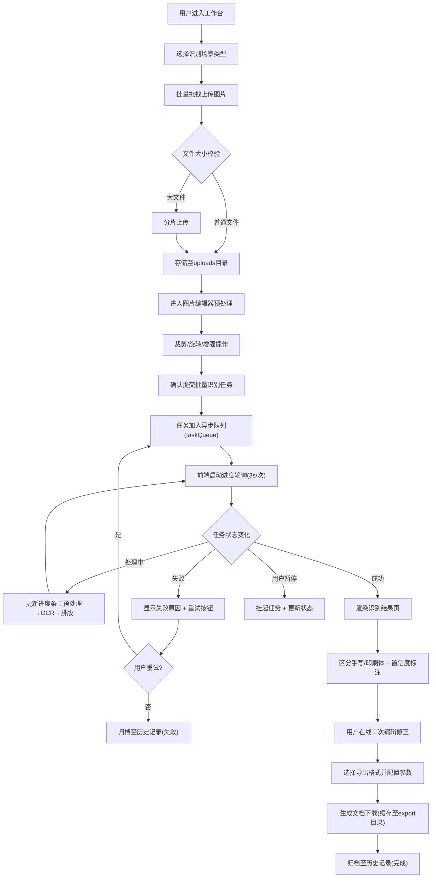

## 1. 产品概述

手写内容识别工具是一款面向教育、办公、金融等场景的网页端OCR识别应用，专注于手写文字的高精准识别与原始排版还原。解决用户将纸质试卷、课堂笔记、财务单据等手写资料快速数字化的痛点，支持连笔、潦草字迹的容错识别，提供智能排版还原与在线编辑修正能力。

- 核心价值：手写体识别准确率高、排版还原度好、批量处理效率高
- 目标用户：教师、学生、文员、财务人员、档案管理员等
- 市场定位：专业级手写OCR识别SaaS工具

---

## 2. 核心功能

### 2.1 功能模块总览

1. **工作台首页**：批量拖拽上传、任务状态看板、快速操作入口
2. **图片编辑器**：预处理(裁剪/旋转/矫正)、区域选择、对比度调整
3. **识别结果页**：原文排版还原、分段换行、表格布局、手写/印刷体区分标注
4. **结果编辑器**：在线二次编辑、置信度标记、批量修正
5. **任务中心**：异步队列调度、实时进度、暂停/重试/取消
6. **历史记录**：分类管理(试卷/笔记/单据/其他)、搜索筛选、批量操作
7. **导出中心**：Word/PDF/Markdown/纯文本多格式导出

### 2.2 页面功能详情

| 页面名称 | 模块名称 | 功能描述 |
|---------|---------|----------|
| 工作台首页 | 拖拽上传区 | 支持批量拖拽图片、点击选择文件、粘贴上传；实时显示文件列表、大小、类型校验 |
| 工作台首页 | 类型快速选择 | 试卷/笔记/单据/自定义标签预设，优化不同场景识别参数 |
| 工作台首页 | 任务看板 | 待处理/进行中/已完成/失败四类任务卡片，显示进度、缩略图 |
| 图片编辑器 | 预览画布 | Canvas渲染大图，支持缩放、拖拽平移、多页切换 |
| 图片编辑器 | 裁剪工具 | 矩形框选裁剪区域，支持自由裁剪/比例裁剪预设 |
| 图片编辑器 | 旋转矫正 | 90度旋转按钮、任意角度旋转滑块、自动倾斜矫正按钮 |
| 图片编辑器 | 图像增强 | 亮度/对比度/锐度调节滑块、去噪、二值化开关 |
| 识别结果页 | 排版还原区 | 模拟原文布局展示识别文字，保留换行、分段、缩进、表格线框 |
| 识别结果页 | 文本类型标注 | 手写体(蓝色下划线)、印刷体(黑色)、低置信度(红色虚线框)视觉区分 |
| 识别结果页 | 图像对照区 | 原图与识别结果左右对照，鼠标联动高亮对应区域 |
| 结果编辑器 | 富文本编辑 | 支持插入/删除/修改文字、合并/拆分段落、调整表格结构 |
| 结果编辑器 | 置信度面板 | 逐字显示识别置信度，一键替换候选词 |
| 任务中心 | 队列列表 | 显示所有任务的ID、名称、类型、进度、状态、创建时间 |
| 任务中心 | 操作控制 | 单任务暂停/继续/重试/取消、批量操作、优先级调整 |
| 任务中心 | 进度轮询 | 实时刷新识别进度条，显示当前处理阶段(预处理/OCR/排版) |
| 历史记录 | 分类筛选 | 按类型/时间/状态/标签多维筛选，关键词搜索 |
| 历史记录 | 详情卡片 | 缩略图预览、识别摘要、字数统计、创建/修改时间 |
| 历史记录 | 批量管理 | 批量删除、批量导出、批量分类移动 |
| 导出中心 | 格式选择 | Word(.docx)/PDF/Markdown/纯文本/TXT/JSON六格式 |
| 导出中心 | 导出配置 | 是否包含图片、是否保留排版、密码保护(PDF)、水印设置 |

---

## 3. 核心流程

### 3.1 主流程描述

用户进入工作台，选择识别场景类型后，通过拖拽/点击上传多张手写图片。系统对每张图片进行格式和大小校验，大文件自动启用分片上传。上传完成后，用户可对每张图片进入编辑器进行裁剪、旋转矫正、对比度调整等预处理操作，确认无误后提交批量识别任务。系统将任务加入异步队列，前端实时轮询显示进度，用户可在任务中心暂停或重试。OCR引擎完成识别后，智能还原原文排版（换行、分段、表格），并在结果页区分手写体与印刷体，标注低置信度区域。用户可在线编辑修正，最终一键导出为Word/PDF等格式文档，所有任务自动归档至历史记录供后续检索。

### 3.2 主流程图

---

## 4. 用户界面设计

### 4.1 设计风格

- **主色调**：深海蓝 `#1e3a5f` 作为品牌主色，搭配天青蓝 `#3b82f6` 交互色，传达专业可靠的工具属性
- **辅助色**：成功绿 `#10b981`、警告橙 `#f59e0b`、错误红 `#ef4444`、信息紫 `#8b5cf6`
- **中性色**：近黑 `#0f172a`、深灰 `#334155`、中灰 `#64748b`、浅灰 `#e2e8f0`、纸白 `#f8fafc`
- **按钮风格**：圆角 `8px`，主按钮采用实色填充+微阴影，次按钮采用描边+悬停填充，尺寸分大(44px)/中(36px)/小(28px)三档
- **字体方案**：标题用"思源黑体 SemiBold"，正文用"思源黑体 Regular"，代码/数字用"JetBrains Mono"，字号从12px到36px共7档
- **布局风格**：顶部导航栏 + 左侧边栏 + 主内容区的三栏工作区布局，卡片采用24px圆角+细腻阴影+微边框
- **图标风格**：统一使用Lucide React线性图标，18px基准尺寸，悬停状态颜色变为主色并轻微放大

### 4.2 页面设计概览

| 页面名称 | 模块名称 | UI元素设计要点 |
|---------|---------|--------------|
| 工作台首页 | Hero区 | 渐变背景(深蓝→青蓝)，大字标题+简洁slogan，右上角用户头像与设置入口 |
| 工作台首页 | 上传区 | 虚线边框容器，拖拽时边框变实+背景色变浅，中央云朵上传图标+提示文字，底部文件队列 |
| 工作台首页 | 场景选择 | 4个图标卡片(试卷/笔记/单据/自定义)，选中态有主色边框+对勾图标 |
| 工作台首页 | 任务看板 | 4列瀑布流布局，每列头部显示分类名称+数量角标，任务卡片显示缩略图+进度条+3点菜单 |
| 图片编辑器 | 工具栏 | 顶部固定工具条，图标按钮分组(导航/裁剪/旋转/增强/重置/确认)，分隔线区分功能组 |
| 图片编辑器 | 画布区 | 浅灰棋盘背景，图片居中显示，右下角缩放百分比显示+缩放滑块 |
| 图片编辑器 | 侧边面板 | 右侧抽屉式面板，包含当前工具的参数调节(旋转角度/对比度数值/裁剪比例预设) |
| 识别结果页 | 分栏布局 | 左侧30%原图预览，右侧70%识别文本，中间可拖拽分隔条 |
| 识别结果页 | 文本区 | 米白纸张背景+细微纹理，文字区域留白模拟真实文档，蓝色波浪下划线标注手写体 |
| 识别结果页 | 悬浮工具条 | 选中文本后出现，含编辑/复制/标记置信度/查看候选词4个操作 |
| 结果编辑器 | 编辑区 | 富文本编辑器样式，段落间距16px，首行缩进2em，表格带浅灰边框 |
| 结果编辑器 | 底部状态栏 | 显示字数统计/手写体占比/平均置信度/保存状态 |
| 历史记录 | 顶部筛选栏 | 搜索框+类型标签(带数量)+时间范围选择器+视图切换(列表/网格) |
| 历史记录 | 卡片网格 | 响应式网格，每张卡片悬停浮起+阴影加深，右上角批量选择复选框 |
| 导出模态框 | 两栏布局 | 左侧格式图标列表，右侧当前格式的详细配置项表单 |

### 4.3 响应式设计

- **桌面端优先**：以1440px宽度为基准设计，侧边栏固定240px，主内容区自适应
- **平板适配(1024px)**：侧边栏可折叠为64px图标栏，上传区单列布局，任务看板2列
- **手机适配(768px)**：顶部导航→底部Tab栏，侧边栏完全隐藏改为抽屉，卡片改为单列全宽，上传区缩小触控目标
- **触控优化**：所有按钮最小触控区44×44px，重要操作按钮加大到48px，支持双指缩放图片、长按唤出操作菜单

---

## 5. 异常场景处理

| 异常场景 | 处理策略 | 用户提示 |
|---------|---------|---------|
| 模糊图片 | 自动去噪+锐化增强，OCR时启用容错模式，结果标注"低清晰度"标签 | "检测到图片较模糊，已自动增强处理，建议补充更清晰图片" |
| 倾斜图片 | 自动检测倾斜角(霍夫变换)并矫正，用户可在编辑器手动微调 | "检测到图片倾斜2.3°，已自动矫正，可手动调整" |
| 多页长图 | 自动按页面空白区域分割为多张子图，分别识别后合并结果 | "检测到长图，已自动分割为5页处理" |
| 超大文件(>50MB) | 自动分片上传(每片2MB)，断点续传，Canvas分片渲染避免卡顿 | "文件较大，正在分片上传中..." |
| 网络中断 | 上传暂停+本地缓存进度，网络恢复后自动续传 | "网络中断，已暂停上传，恢复后自动继续" |
| OCR识别失败 | 重试3次(指数退避)，仍失败则标记失败并保留原图供手动处理 | "识别失败，已重试3次，可点击重试或更换图片" |
