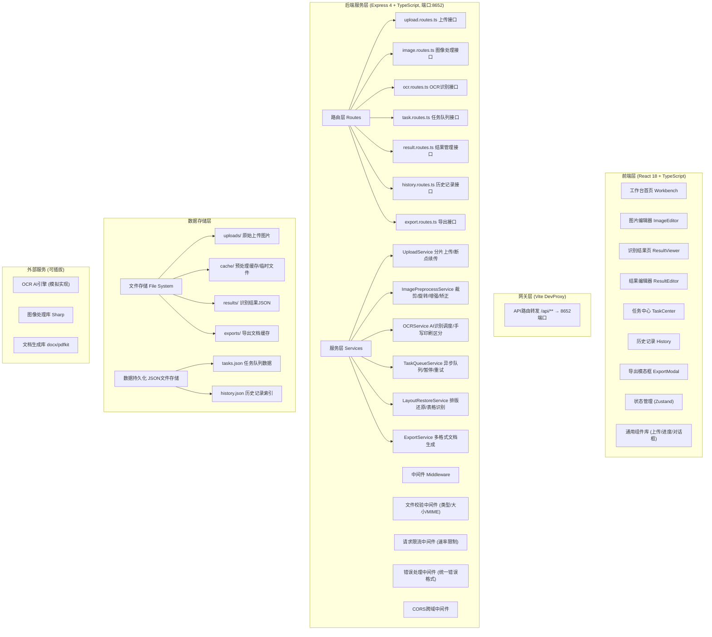
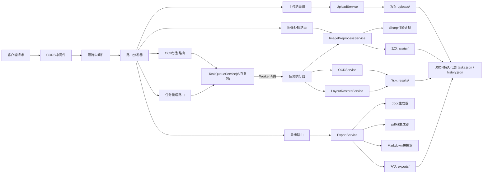

## 1. 架构设计



---

## 2. 技术选型说明

- **前端框架**：React@18 + React Router@6，组件化开发，Hooks管理生命周期
- **状态管理**：Zustand@4，轻量级状态库，避免Redux繁琐样板
- **UI样式**：TailwindCSS@3 + PostCSS + Autoprefixer，原子化CSS
- **构建工具**：Vite@5，开发热更新快，打包优化好
- **图标库**：Lucide React，统一风格的线性图标
- **后端框架**：Express@4 + TypeScript + ESM模块
- **图像处理**：Sharp (高性能Node.js图像处理库)
- **异步队列**：自定义内存队列 + Worker模式，支持暂停/重试/优先级
- **文档生成**：docx (Word生成) + pdfkit (PDF生成)
- **数据存储**：文件系统 + JSON文件持久化 (简单场景，无需数据库)
- **代码规范**：TypeScript严格模式 + ESLint

---

## 3. 路由定义

### 3.1 前端路由

| 路由路径 | 页面组件 | 功能描述 |
|---------|---------|---------|
| `/` | Workbench.tsx | 工作台首页 - 上传与任务概览 |
| `/editor/:taskId?` | ImageEditor.tsx | 图片编辑器 - 预处理交互 |
| `/result/:taskId` | ResultViewer.tsx | 识别结果展示 - 排版还原 |
| `/edit/:taskId` | ResultEditor.tsx | 结果编辑器 - 二次修正 |
| `/tasks` | TaskCenter.tsx | 任务中心 - 队列管理 |
| `/history` | History.tsx | 历史记录 - 分类管理 |

### 3.2 后端API路由 (端口8652)

| 方法 | 路径 | 功能 | 请求体/参数 | 响应格式 |
|-----|------|------|------------|---------|
| POST | `/api/upload/init` | 初始化分片上传 | `{ filename, size, type, chunks }` | `{ uploadId, chunkSize }` |
| POST | `/api/upload/chunk` | 上传单个分片 | `FormData: uploadId, chunkIndex, file` | `{ received: true, index }` |
| POST | `/api/upload/merge` | 合并分片 | `{ uploadId, filename }` | `{ fileId, url, size }` |
| POST | `/api/upload/single` | 小文件直传 | `FormData: file, category` | `{ fileId, url, size }` |
| GET | `/api/image/:id` | 获取图片元信息 | URL参数 id | `{ id, width, height, size, url }` |
| POST | `/api/image/preprocess` | 图片预处理 | `{ fileId, operations: [crop, rotate, enhance] }` | `{ processedId, url, preview }` |
| POST | `/api/image/autocorrect` | 自动倾斜矫正 | `{ fileId }` | `{ processedId, angle, url }` |
| POST | `/api/ocr/submit` | 提交OCR识别任务 | `{ fileIds: [], category, options: {} }` | `{ taskId, status: 'queued' }` |
| GET | `/api/ocr/task/:taskId` | 查询任务状态 | URL参数 taskId | `{ taskId, status, progress, stages: [] }` |
| GET | `/api/ocr/result/:taskId` | 获取识别结果 | URL参数 taskId | `{ taskId, content, blocks, confidence, layout }` |
| POST | `/api/tasks/list` | 获取任务列表 | `{ status?, category?, page, pageSize }` | `{ total, items: [] }` |
| POST | `/api/tasks/:id/pause` | 暂停任务 | URL参数 id | `{ taskId, status: 'paused' }` |
| POST | `/api/tasks/:id/resume` | 恢复任务 | URL参数 id | `{ taskId, status: 'running' }` |
| POST | `/api/tasks/:id/retry` | 重试任务 | URL参数 id | `{ taskId, status: 'queued', retryCount }` |
| DELETE | `/api/tasks/:id` | 取消/删除任务 | URL参数 id | `{ deleted: true }` |
| PUT | `/api/result/:taskId` | 更新识别结果(编辑保存) | `{ taskId, content, blocks }` | `{ saved: true, version }` |
| POST | `/api/history/list` | 历史记录列表 | `{ category?, keyword?, page, pageSize, sort }` | `{ total, items: [], categories }` |
| PUT | `/api/history/:id` | 更新历史记录分类/标签 | `{ id, category, tags }` | `{ updated: true }` |
| DELETE | `/api/history/batch` | 批量删除历史 | `{ ids: [] }` | `{ deletedCount }` |
| POST | `/api/export/generate` | 生成导出文档 | `{ taskId, format: 'docx'\|'pdf'\|'md'\|'txt', options }` | `{ exportId, status }` |
| GET | `/api/export/download/:exportId` | 下载导出文件 | URL参数 exportId | 文件流 |

---

## 4. 核心数据类型定义

```typescript
// ===== 共享类型 shared/types.ts =====

export type FileCategory = 'exam' | 'note' | 'receipt' | 'custom';
export type TaskStatus = 'queued' | 'preprocessing' | 'ocr_running' | 'layout_restoring' | 'paused' | 'completed' | 'failed';
export type TextType = 'handwritten' | 'printed' | 'mixed';
export type ExportFormat = 'docx' | 'pdf' | 'markdown' | 'txt' | 'json';

export interface UploadFile {
  id: string;
  originalName: string;
  storedName: string;
  path: string;
  url: string;
  size: number;
  mimeType: string;
  category: FileCategory;
  width?: number;
  height?: number;
  uploadedAt: number;
  chunks?: { total: number; uploaded: number };
}

export interface ImageOperation {
  type: 'crop' | 'rotate' | 'flip' | 'enhance' | 'denoise' | 'binarize';
  params: Record<string, any>;
}

export interface PreprocessConfig {
  fileId: string;
  operations: ImageOperation[];
}

export interface TextBlock {
  id: string;
  type: TextType;
  content: string;
  confidence: number;
  candidates?: string[];
  boundingBox?: { x: number; y: number; w: number; h: number };
  pageIndex?: number;
  lineIndex?: number;
}

export interface ParagraphBlock {
  id: string;
  type: 'paragraph' | 'heading' | 'table' | 'list';
  texts: TextBlock[];
  indent?: number;
  alignment?: 'left' | 'center' | 'right';
  tableData?: string[][];
}

export interface LayoutResult {
  pages: number;
  blocks: ParagraphBlock[];
  statistics: {
    totalChars: number;
    handwrittenChars: number;
    printedChars: number;
    avgConfidence: number;
  };
}

export interface OCRTask {
  id: string;
  name: string;
  category: FileCategory;
  fileIds: string[];
  status: TaskStatus;
  progress: number;
  currentStage: 'pending' | 'preprocess' | 'ocr' | 'layout' | 'done';
  stageProgress: { preprocess: number; ocr: number; layout: number };
  retryCount: number;
  error?: { code: string; message: string };
  result?: LayoutResult;
  createdAt: number;
  updatedAt: number;
  pausedAt?: number;
}

export interface HistoryRecord {
  id: string;
  taskId: string;
  name: string;
  category: FileCategory;
  thumbnail: string;
  summary: string;
  charCount: number;
  status: TaskStatus;
  tags: string[];
  createdAt: number;
  lastViewedAt: number;
  taskSnapshot: Partial<OCRTask>;
}

export interface ExportRequest {
  taskId: string;
  format: ExportFormat;
  options: {
    includeImages?: boolean;
    preserveLayout?: boolean;
    watermark?: string;
    password?: string;
    filename?: string;
  };
}

export interface TaskProgress {
  taskId: string;
  status: TaskStatus;
  progress: number;
  currentStage: string;
  stageDetail?: string;
  etaSeconds?: number;
}
```

---

## 5. 后端服务架构图



---

## 6. 目录结构

```
lj0012/
├── .trae/documents/              # 项目文档
├── src/                          # 前端源码
│   ├── components/               # 通用组件
│   │   ├── upload/               # 上传相关组件
│   │   │   ├── DropZone.tsx      # 拖拽上传区
│   │   │   ├── FileList.tsx      # 文件列表
│   │   │   └── ChunkUploader.tsx # 分片上传器
│   │   ├── editor/               # 图片编辑器组件
│   │   │   ├── Canvas.tsx        # Canvas画布
│   │   │   ├── CropTool.tsx      # 裁剪工具
│   │   │   ├── RotateTool.tsx    # 旋转工具
│   │   │   └── EnhancePanel.tsx  # 增强面板
│   │   ├── task/                 # 任务相关组件
│   │   │   ├── ProgressBar.tsx   # 进度条
│   │   │   ├── TaskCard.tsx      # 任务卡片
│   │   │   └── TaskQueue.tsx     # 任务队列
│   │   ├── result/               # 识别结果组件
│   │   │   ├── LayoutView.tsx    # 排版视图
│   │   │   ├── TextBlockView.tsx # 文字块(含置信度)
│   │   │   ├── RichEditor.tsx    # 富文本编辑器
│   │   │   └── CompareView.tsx   # 左右对照视图
│   │   ├── export/               # 导出组件
│   │   │   └── ExportModal.tsx   # 导出配置弹窗
│   │   └── ui/                   # 基础UI组件
│   ├── hooks/                    # 自定义Hooks
│   │   ├── useChunkUpload.ts     # 分片上传Hook
│   │   ├── useTaskPolling.ts     # 任务进度轮询Hook
│   │   ├── useImageProcessor.ts  # 图像处理Hook
│   │   └── useHistory.ts         # 历史记录Hook
│   ├── pages/                    # 页面组件
│   │   ├── Workbench.tsx         # 工作台
│   │   ├── ImageEditor.tsx       # 图片编辑器
│   │   ├── ResultViewer.tsx      # 结果展示
│   │   ├── ResultEditor.tsx      # 结果编辑
│   │   ├── TaskCenter.tsx        # 任务中心
│   │   └── History.tsx           # 历史记录
│   ├── stores/                   # Zustand状态
│   │   ├── uploadStore.ts        # 上传状态
│   │   ├── taskStore.ts          # 任务状态
│   │   ├── resultStore.ts        # 结果状态
│   │   └── userPrefStore.ts      # 用户偏好
│   ├── utils/                    # 工具函数
│   │   ├── api.ts                # API封装
│   │   ├── image.ts              # 图像处理工具
│   │   ├── file.ts               # 文件处理工具
│   │   └── format.ts             # 格式化工具
│   ├── App.tsx
│   ├── main.tsx
│   └── index.css
├── api/                          # 后端源码 (Express)
│   ├── index.ts                  # 服务入口 (监听8652)
│   ├── routes/                   # 路由层
│   │   ├── upload.routes.ts
│   │   ├── image.routes.ts
│   │   ├── ocr.routes.ts
│   │   ├── task.routes.ts
│   │   ├── result.routes.ts
│   │   ├── history.routes.ts
│   │   └── export.routes.ts
│   ├── services/                 # 服务层
│   │   ├── UploadService.ts
│   │   ├── ImagePreprocessService.ts
│   │   ├── OCRService.ts
│   │   ├── TaskQueueService.ts
│   │   ├── LayoutRestoreService.ts
│   │   ├── HistoryService.ts
│   │   └── ExportService.ts
│   ├── middleware/               # 中间件
│   │   ├── fileValidator.ts
│   │   ├── rateLimiter.ts
│   │   └── errorHandler.ts
│   ├── utils/                    # 工具
│   │   ├── storage.ts            # 文件存储管理
│   │   ├── idGenerator.ts
│   │   └── mockOCR.ts            # 模拟OCR引擎
│   └── config.ts                 # 配置
├── shared/                       # 前后端共享类型
│   └── types.ts
├── storage/                      # 文件存储目录 (运行时创建)
│   ├── uploads/                  # 原始上传文件
│   ├── cache/                    # 预处理缓存
│   ├── results/                  # 识别结果JSON
│   ├── exports/                  # 导出文档
│   └── data/                     # JSON数据持久化
├── vite.config.ts
├── tsconfig.json
├── tsconfig.node.json
├── tailwind.config.js
├── postcss.config.js
└── package.json
```

---

## 7. 关键技术实现点

### 7.1 大文件分片上传
- **前端**：按2MB切分File对象，Blob.slice()分片，并发控制(3个)，失败重试(指数退避)，localStorage记录已上传分片索引
- **后端**：uploadId映射临时目录，分片存储后fs.appendFileSync合并，MD5校验完整性

### 7.2 异步任务队列
- **内存队列**：Array + 指针实现，支持优先级(weight字段)，挂起/恢复状态控制
- **Worker**：setInterval(100ms)轮询取出队首任务，async/await串行执行，暂停时保存阶段状态
- **持久化**：任务变化每5秒批量写入tasks.json，服务重启时恢复队列

### 7.3 图像处理(Canvas + Sharp)
- **前端编辑器**：Canvas实现实时预览，离屏Canvas计算裁剪/旋转矩阵，变换矩阵序列化后传给后端
- **后端处理**：Sharp执行实际裁剪(.extract)、旋转(.rotate)、亮度(.modulate)、锐化(.sharpen)
- **自动矫正**：霍夫变换检测线条角度，取众数作为倾斜角，Sharp执行矫正旋转

### 7.4 模拟OCR引擎
- 生成结构化TextBlock数组，按区域随机分配手写/印刷体标签
- 置信度正态分布(手写体均值0.78，印刷体均值0.93)
- 表格识别：检测横线+竖线网格，映射cells矩阵，生成tableData二维数组

### 7.5 排版还原
- 按y坐标聚类分行(block.y相似度<15px)，按x坐标排序
- 行间距>30px识别为段落分段，首行x>50px识别为首行缩进
- 识别表格区域渲染<table>，列表前缀识别(数字/圆点/字母)渲染列表

### 7.6 文档导出
- **docx**：docx库，Paragraph+TextRun构建段落，Table+TableRow构建表格
- **pdf**：pdfkit，按坐标绘制文本，模拟版式
- **md/txt**：字符串模板拼接，表格转Markdown表格语法
